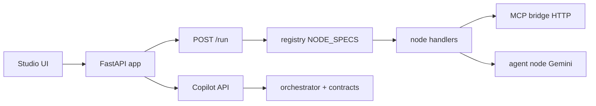

# Architecture & code paths

## High-level flow



1. User builds a DAG in React (`frontend/src/components/WorkflowCanvas`).
2. `POST /run` validates and executes nodes in topological order (`backend/engine/dag_runner.py`).
3. Each node type resolves to a **handler** from `NODE_SPECS` (`backend/engine/registry.py`).
4. Handlers that accept upstream outputs use signature `(node, ctx, incoming)` and are wrapped by `backend/engine/orchestrator_runtime.py`.
5. Integration nodes call HTTP (MCP bridge, GitHub API, etc.) or LLM (agent).

## Repository map

| Path | Purpose |
|------|---------|
| `frontend/src/components/RightPanel/ConfigView.tsx` | Node inspector: maps YAML `widget` → field editors (incl. Starlark, MCP secrets) |
| `frontend/src/nodes/generated.ts` | **Generated** — colors, icons, palette sections, `NodeType` union |
| `backend/engine/nodes/<id>.yaml` | Node contract + UI metadata (**edit this**) |
| `backend/engine/nodes/<id>.py` | Runtime handler + `NODE_SPEC = _spec_from_yaml(...)` |
| `backend/engine/registry.py` | Auto-imports `NODE_SPEC` from `nodes/` + `nodes_legacy/` |
| `backend/engine/starlark_sandbox.py` | Hermetic Starlark for `code` node |
| `backend/engine/orchestrator_runtime.py` | `incoming` map + `apply_output_to_ctx` |
| `backend/contracts/node_contracts.json` | **Generated** — Copilot / API JSON contracts |
| `backend/copilot/workflow_generator.py` | Streaming workflow generation |
| `backend/copilot/orchestrator_pipeline.py` | Structured plan + few-shot node examples |
| `backend/mcp_bridge/` | HTTP MCP tools (Confluence, Jira, GitHub) |
| `backend/app/mcp_lifecycle.py` | Auto-start bridge subprocess on workflow run |
| `backend/workflows/studio_*.json` | Checked-in demo DAGs |
| `backend/data_sources/metadata/*.yaml` | Dataset schemas for `csv_extract` / `db_query` |

## Adding or changing a node (engineer / repo agent)

1. Create `backend/engine/nodes/my_node.yaml` (see [node-yaml-and-ui.md](./node-yaml-and-ui.md)).
2. Create `backend/engine/nodes/my_node.py` with `run(...)` and `NODE_SPEC = _spec_from_yaml(Path(__file__).parent / "my_node.yaml", run)`.
3. If the handler needs upstream rows: `def run(node, ctx, incoming: dict[str, Any])` — three parameters named `incoming` triggers the wrapper.
4. Run `python backend/scripts/gen_artifacts.py` from repo root.
5. Commit YAML, PY, and generated artifacts.
6. Add a studio workflow under `backend/workflows/` if the node is user-facing.

## Runtime: how `incoming` works

`build_incoming_outputs` (`orchestrator_runtime.py`) builds `{upstream_node_id: output_dict}` for all edges targeting the current node. Handlers typically take the first upstream with `rows`:

```python
def _upstream_rows(incoming: dict[str, Any]) -> list[dict]:
    for out in incoming.values():
        if isinstance(out, dict) and isinstance(out.get("rows"), list):
            return list(out["rows"])
    return []
```

Multi-input nodes (e.g. `join`, `excel_output`) iterate **all** values in `incoming` (order follows edge list in the workflow JSON).

## Studio vs legacy nodes

| Package | Studio palette | Runtime |
|---------|----------------|---------|
| `engine/nodes/` | Yes (unless `config_tags: [legacy]`) | Yes |
| `engine/nodes_legacy/` | Hidden | Yes (old workflows) |

Approved studio types are listed in `backend/engine/studio_nodes.py` and [STUDIO_DEMOS.md](../backend/workflows/STUDIO_DEMOS.md).

## Tests (useful entry points)

| Test file | Covers |
|-----------|--------|
| `backend/tests/test_code_starlark_node.py` | Starlark `code` node |
| `backend/tests/test_mcp_integration_workflows.py` | MCP demo tools |
| `backend/tests/test_studio_demo_workflows.py` | `studio_*.json` graphs |
| `backend/tests/test_orchestrator_validator.py` | Copilot validator |

## API endpoints (debugging)

| Endpoint | Role |
|----------|------|
| `POST /run` | Execute workflow |
| `POST /validate` | Graph + config validation |
| `GET /node-manifest` | Studio palette metadata |
| Copilot routes in `backend/app/routers/copilot.py` | Generate / repair workflows |
